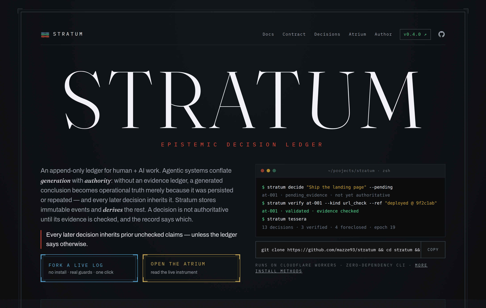
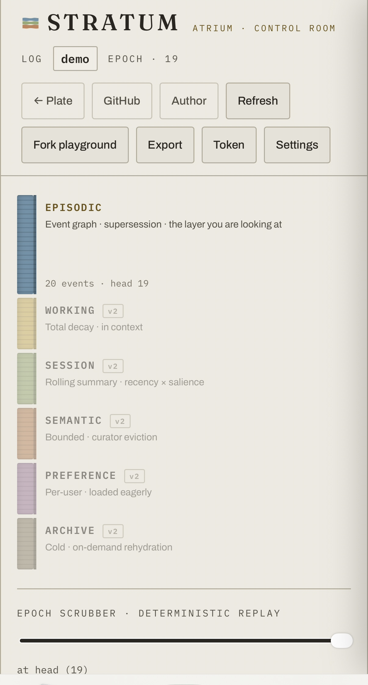
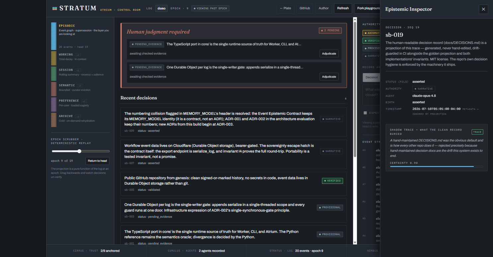

# Stratum

<p align="center">
  
</p>

[](https://github.com/mazze93/stratum/actions/workflows/ci.yml)

**An epistemic decision ledger — evidence-gated trust for human + AI work.**

Live: **[stratum.mazzeleczzare.com](https://stratum.mazzeleczzare.com)** — the survey plate;
the **[Atrium control room](https://stratum.mazzeleczzare.com/atrium/)** projects the demo log:
the recorded trace of this repository's own construction.

<p align="center">
  
</p>

<p align="center"><sub>The Atrium, live on a phone — <a href="https://stratum.mazzeleczzare.com/atrium/">stratum.mazzeleczzare.com/atrium/</a>.</sub></p>

---

## The problem

Agentic systems assert. Whatever an LLM writes down becomes "true" by persistence: a
session summary that drops a foreclosed option, softens a constraint, or invents a
decision passes every syntactic gate and then becomes the authoritative input to the
next session. The failure isn't malice — it's that *generation* and *authority* are
conflated. Most memory layers for AI systems store narratives and then trust them.

## The move

Stratum stores **events**, and derives everything else:

- **Status is a fold over the log, never a stored field.** An event is immutable once
  appended; its status at any epoch is computed from transition markers ordered by
  logical sequence. Wall-clock time is metadata — ignored by every projection path.
- **Authoritative fields are projections.** The Tessera (canonical handoff state) is a
  pure function of the log at an epoch. There is nothing to hallucinate: prose fields
  exist, but they are marked narrative and are *never* canonical. For a rendered
  example of the form, see [a published tessera record](https://mazzeleczzare.com/artifacts/tessera-claude-anchor).
- **Verification requires checked evidence.** `checked_at == null` means *cited, not
  checked*, and only checked evidence counts — everywhere, including quorum. A claim
  cannot reach `validated` without it (invariant I1).
- **Axiom-trust and evidence-trust are different tiers.** Trusted-because-an-authority-
  declared-it (`axiomatic`) never renders as trusted-because-evidence-was-checked
  (`verified`). Collapsing them was a real defect once; the projection keeps the
  system's reliance on declared authority visible.
- **Review is derived, not stored.** An event is under review iff a *live* invalidation
  targets evidence it depends on. Overturn the invalidation and review clears — there is
  no cleanup actor because there is nothing to clean.
- **Fail-closed.** Completeness is undecidable, so an authoritative field with no
  backing event raises instead of defaulting.
- **Replay is proven, not asserted.** Serialize → reload (every guard re-runs) →
  reproject → identical (invariant I4). The export endpoint *is* the portability
  guarantee.

The full contract is [docs/MEMORY_MODEL.md](docs/MEMORY_MODEL.md); the design review
that produced it is [docs/ARCHITECTURE-EVALUATION.md](docs/ARCHITECTURE-EVALUATION.md)
(ADR-001: Tessera fields as projections; ADR-002: a single synchronous policy gate).

## Validated on itself

MEMORY_MODEL §8 names exactly one open empirical risk: *the ontology is unvalidated
against a real session trace.* This repository closes it recursively —
[`data/genesis-trace.jsonl`](data/genesis-trace.jsonl) is the decision record of this
system's own construction, written as Stratum events while the build happened: the
human mandate enters as a ratified trust root (`axiomatic`), architecture decisions
enter as `pending_evidence` and earn `verified` only when checked evidence (test runs,
live round-trips, commit SHAs) lands, roads not taken are first-class `foreclosure`
events, and every decision carries its **shadow trace** — the alternatives it buried,
with an honesty tag (`TRACE`/`RECON`) and a certainty weight.

The public demo is that trace. The first dataset in the system is the system.

<p align="center">
  
</p>

<p align="center"><sub>This is the actual figure the Worker serves at <a href="https://stratum.mazzeleczzare.com">stratum.mazzeleczzare.com</a> — a static render of <a href="data/genesis-trace.jsonl"><code>data/genesis-trace.jsonl</code></a>, reproduced here directly from the self-hosted source (<code>scripts/render-strata-svg.mjs</code>), not a screenshot.</sub></p>

<p align="center">
  
</p>

<p align="center"><sub>The shadow trace, live: selecting any decision opens both its clean record and the alternatives it buried.</sub></p>

## What exists

<p align="center">
  
</p>

<p align="center"><sub><a href="core/"><code>core/</code></a> · <a href="reference/"><code>reference/</code></a> · <a href="worker/"><code>worker/</code></a> · <a href="atrium/"><code>atrium/</code></a> · <a href="cli/"><code>cli/</code></a> · <a href="docs/DECISIONS.md"><code>docs/DECISIONS.md</code></a></sub></p>

### Try it

The [live demo](https://stratum.mazzeleczzare.com/atrium/) is read-only; **Fork playground**
clones it into a private sandbox where writes run the full guards — append something
illegal and the gate answers with the violation. Or locally:

```sh
npm install
npm test                 # 22 tests: 16 invariants + boundary + oracle parity
npm run test:reference   # the Python oracle's own 16/16
npm run dev              # wrangler dev + the Atrium on localhost
```

CLI:

```sh
cd cli && npm link
stratum init --endpoint https://your-instance --token <token> --log workspace
stratum decide "Ship the thing" --pending
stratum verify dec-xxxx --ref "test run @ commit"
stratum tessera
```

## Verification discipline

- 16 contract invariants, implemented twice (Python reference + TypeScript port),
  cross-checked by a golden projection file — regenerating it is a CI gate, so the
  implementations cannot drift silently.
- Guards re-run on every load: a corrupt persisted log fails at the door, never
  silently in projection.
- The deployed gate is verified live: unauthorized reads 401, illegal appends 409,
  playground isolation, projection parity with the local oracle.

## Perimeter — what this does not claim

The contract guarantees **provenance and internal consistency**, not correctness. A
decision can be validated by a green test that asserts nothing meaningful; evidence can
point at the wrong artifact; the judgment behind a decision can simply be wrong.
Evidence-backing moves the question from *"did the model assert it?"* to *"did the
referenced check pass?"* — a strict improvement, not a resolution. The hallucination
surface relocated to the semantic adequacy of evidence references; closing that gap
lives in review discipline and human arbitration, outside this system's frame.
Acknowledging the perimeter is the guarantee.

## Research agenda

Open problems, named in the architecture evaluation and carried here honestly:

1. **Capability ontology granularity** — the make-or-break usability decision for a
   deny-by-default policy gate: too fine and no human maintains it, too coarse and
   grants leak.
2. **Precedent decay** — recorded arbitrations become precedent; without a half-life or
   supersession rule, stale precedent silently steers current decisions.
3. **Assurance tiers** — the orchestration-cost model: `assurance: high` invokes full
   verification chains, `low` doesn't tax a 20-minute fix.
4. **Multi-parent lineage** — diamond revision graphs are rejected at write time in v1;
   modeling them is an explicit extension.
5. **The authority registry, recursively** — quorum doesn't end the trust regress, it
   relocates it into key management. The registry should itself be an instance of this
   contract: append-only, quorum-gated, epoch-pinned, bottoming out at a named,
   versioned genesis authority set. Integration target: **Stele** (policy governance)
   signing `policy_authority` evidence — the PKI the Trust-Anchor section already names.

These are the questions a trust layer for agentic systems has to answer; Stratum is a
working substrate to answer them on.

<p align="center">
  
</p>

## Provenance

Built in one supervised session, 2026-07-10; public surface added 2026-07-23. The git
history is the checkpoint record; the traces are the decision record;
[docs/DECISIONS.md](docs/DECISIONS.md) is a projection of all three. Status: working
prototype in daily use — v0.4.0, carrying the same event contract (unchanged since
rev 3) behind a live gate. Not a finished product.

## License

MIT — see [LICENSE](LICENSE).
