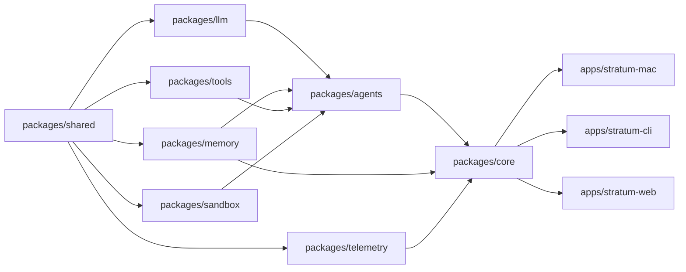

# IMPLEMENTATION.md — Stratum

*Production-scale repository structure, roadmap, dependency graph, high-value additions, and aesthetic specification.*

Reads against: `SPEC.md`, `cognitive-architecture-paper.md`.

---

## 1. Repository Structure

Monorepo. SwiftPM workspace at the root. Web console as a subpackage with its own pnpm workspace.

```
stratum/
├── apps/
│   ├── stratum-mac/               # Swift/SwiftUI macOS app shell
│   │   ├── Sources/
│   │   │   ├── App/               # @main, app delegate, scenes
│   │   │   ├── Atrium/            # Cognitive topology surface
│   │   │   ├── Inspector/         # ⌘I observability panel
│   │   │   ├── Conversation/      # Per-task conversation surface
│   │   │   ├── SpecEditor/        # Spec.md editor with ratification UI
│   │   │   ├── MemoryBrowser/     # Per-tier memory inspection
│   │   │   ├── Arbitration/       # Modal arbitration surface
│   │   │   └── Theme/             # Tokens, motion, typography
│   │   ├── Resources/
│   │   └── Tests/
│   ├── stratum-cli/               # `stra` CLI; same Core
│   │   ├── Sources/
│   │   │   ├── Commands/          # init, serve, run, sync, replay
│   │   │   └── Output/            # Rich terminal formatting
│   │   └── Tests/
│   └── stratum-web/               # Read-only remote inspector (SvelteKit)
│       ├── src/
│       │   ├── routes/
│       │   ├── lib/
│       │   └── components/
│       └── tests/
├── packages/
│   ├── core/                      # The brain. Shared by app and CLI.
│   │   ├── Sources/
│   │   │   ├── Orchestrator/      # Workflow engine, routing
│   │   │   ├── State/             # ProjectState, reducers, snapshots
│   │   │   ├── Audit/             # Append-only audit log
│   │   │   ├── Compilation/       # Prompt compiler
│   │   │   └── Replay/            # Deterministic replay engine
│   │   └── Tests/
│   ├── agents/                    # Agent role implementations
│   │   ├── Sources/
│   │   │   ├── AgentKit/          # Protocol, base scaffold
│   │   │   ├── Planner/
│   │   │   ├── Researcher/
│   │   │   ├── Architect/
│   │   │   ├── SpecCompiler/
│   │   │   ├── Executor/
│   │   │   ├── Critic/
│   │   │   ├── Verifier/
│   │   │   ├── FaultInjection/
│   │   │   ├── Historian/
│   │   │   ├── MemoryCurator/
│   │   │   ├── Orchestrator/      # Routing agent (the meta-agent)
│   │   │   └── UXInterpreter/
│   │   └── Tests/
│   ├── memory/                    # Memory hierarchy implementation
│   │   ├── Sources/
│   │   │   ├── Tiers/             # Working, Session, Episodic, Semantic, Preference, Archive
│   │   │   ├── Tessera/           # Tessera generation, parsing, storage
│   │   │   ├── Retrieval/         # Query engine, scoring
│   │   │   ├── Embeddings/        # sqlite-vec interface, model selection
│   │   │   └── Migrations/        # Schema evolution
│   │   └── Tests/
│   ├── llm/                       # LLM adapters
│   │   ├── Sources/
│   │   │   ├── AdapterKit/        # Protocol, capabilities
│   │   │   ├── Anthropic/
│   │   │   ├── OpenAI/
│   │   │   ├── OpenRouter/
│   │   │   ├── Ollama/
│   │   │   ├── LlamaCpp/
│   │   │   └── CoreML/            # On-device classifiers and embeddings
│   │   └── Tests/
│   ├── sandbox/                   # Isolated execution
│   │   ├── Sources/
│   │   │   ├── OrbStack/          # Primary backend
│   │   │   ├── Docker/            # Fallback backend
│   │   │   ├── Native/            # Restricted-entitlement native exec
│   │   │   └── Lifecycle/         # Warm pool, snapshot, teardown
│   │   └── Tests/
│   ├── telemetry/                 # Local observability
│   │   ├── Sources/
│   │   │   ├── AuditLog/
│   │   │   ├── ReplayStore/
│   │   │   ├── Metrics/
│   │   │   └── Exporters/         # OTel, opt-in
│   │   └── Tests/
│   ├── tools/                     # Tool catalog
│   │   ├── Sources/
│   │   │   ├── ToolKit/           # Protocol, schema, permissions
│   │   │   ├── FileTools/         # read, write (sandboxed)
│   │   │   ├── SearchTools/       # ripgrep wrapper, semantic search
│   │   │   ├── TestRunners/       # XCTest, swift test, npm test, pytest
│   │   │   ├── WebTools/          # fetch, search (Researcher only)
│   │   │   ├── GitTools/          # branch, commit, diff
│   │   │   └── LintTools/         # SwiftLint, ESLint, ruff
│   │   └── Tests/
│   └── shared/                    # Cross-cutting types and utilities
│       ├── Sources/
│       │   ├── Schemas/           # Codable types, JSON Schema exports
│       │   ├── Crypto/            # libsodium wrappers
│       │   ├── Time/              # Monotonic clocks, formatting
│       │   └── Logging/           # Structured logging
│       └── Tests/
├── agents/                        # User-facing agent prompts (versioned)
│   ├── planner/
│   │   ├── v1.prompt.md
│   │   ├── v2.prompt.md
│   │   └── tests/                 # Regression inputs and recorded outputs
│   ├── researcher/
│   ├── architect/
│   ├── spec-compiler/
│   ├── executor/
│   ├── critic/
│   ├── verifier/
│   ├── fault-injection/
│   ├── historian/
│   ├── memory-curator/
│   └── ux-interpreter/
├── memory/                        # Memory schemas and defaults
│   ├── schemas/
│   │   ├── working.schema.json
│   │   ├── session.schema.json
│   │   ├── episodic.schema.json
│   │   ├── semantic.schema.json
│   │   ├── preference.schema.json
│   │   └── tessera.schema.json
│   └── defaults/
│       └── preference-defaults.yaml
├── orchestration/                 # Workflow definitions
│   ├── workflows/
│   │   ├── standard-implement.workflow.yaml
│   │   ├── high-assurance.workflow.yaml
│   │   ├── research.workflow.yaml
│   │   ├── refactor.workflow.yaml
│   │   └── triage.workflow.yaml
│   └── schemas/
│       └── workflow.schema.json
├── prompts/                       # Compiled prompt fragments (shared)
│   ├── fragments/
│   │   ├── system-preamble.md
│   │   ├── safety-guard.md
│   │   ├── output-schema.md
│   │   └── escalation-rules.md
│   └── compiler/
│       └── compile.rules.yaml
├── specs/                         # Stratum's own specs
│   ├── architecture/
│   │   ├── orchestration.spec.md
│   │   ├── memory.spec.md
│   │   ├── sandbox.spec.md
│   │   └── ui.spec.md
│   └── features/
│       ├── tessera.spec.md
│       ├── inspector.spec.md
│       └── arbitration.spec.md
├── tests/                         # Cross-package integration tests
│   ├── e2e/
│   │   ├── plan-to-implement.swift
│   │   ├── arbitration-flow.swift
│   │   └── tessera-roundtrip.swift
│   ├── adversarial/
│   │   ├── sandbox-escape/
│   │   └── memory-poisoning/
│   ├── perf/
│   │   ├── cold-start.swift
│   │   └── retrieval-latency.swift
│   └── accessibility/
│       └── voiceover-flows.swift
├── infra/                         # Build, signing, distribution
│   ├── ci/
│   │   ├── github-actions/
│   │   └── pre-commit/
│   ├── signing/
│   │   ├── notarize.sh
│   │   └── entitlements.plist
│   ├── packaging/
│   │   ├── dmg-build.sh
│   │   └── homebrew-cask/
│   └── release/
│       └── release-notes.template.md
├── telemetry/                     # Schemas for telemetry events
│   ├── schemas/
│   │   ├── agent-invocation.event.json
│   │   ├── state-transition.event.json
│   │   └── arbitration.event.json
│   └── dashboards/
│       └── local-grafana/         # Optional self-hosted view
└── docs/
    ├── README.md
    ├── cognitive-architecture-paper.md
    ├── SPEC.md
    ├── IMPLEMENTATION.md          # This file
    ├── CONTRIBUTING.md
    ├── DECISIONS/                 # ADRs
    │   ├── 0001-swift6-over-rust.md
    │   ├── 0002-sqlite-over-duckdb.md
    │   ├── 0003-orbstack-as-default.md
    │   └── ...
    └── tutorials/
        ├── first-spec.md
        ├── building-an-agent.md
        └── writing-a-workflow.md
```

### Directory Notes

- **`packages/core`** is the single source of truth for state and orchestration. Both the macOS app and the CLI depend on it.
- **`packages/agents`** contains agent *runtime code*, not prompts. The prompts live at top-level `agents/` and are versioned independently for change-control reasons (a prompt change is a behavior change).
- **`agents/*/tests/`** holds regression suites — fixed inputs with recorded outputs. CI runs these against the production prompt version.
- **`orchestration/workflows/`** are the routing graphs. They are YAML so non-engineers can review them.
- **`specs/`** holds Stratum's own internal specs (Stratum eats its own dogfood).
- **`tests/`** at the root is for cross-package integration and adversarial tests. Unit tests live with their packages.

---

## 2. Milestone Roadmap

Five milestones to v1.0. Each milestone has a definition of done that gates the next.

### M0 — Foundation (Weeks 1–3)

**Goal:** A workbench process exists. State management works. The Orchestrator can route a single hardcoded workflow with mock agents.

- Core state types and reducers
- Audit log with structured events
- Workflow loader and validator
- Mock agent infrastructure
- CI scaffold (build, lint, test, accessibility check stubs)
- One LLM adapter (Anthropic) with streaming
- Initial macOS app shell that opens a project and shows raw state

**Done when:** A scripted workflow runs end-to-end against mocks, producing a state transition record visible in the app shell.

### M1 — Single-Agent Loop (Weeks 4–7)

**Goal:** One real workflow: write a spec, ratify it, get a single Executor run against a single ticket.

- Real Planner, UX Interpreter, Spec Compiler, Executor, Verifier agents
- Working memory and session memory tiers
- Prompt compiler with fragment system
- Sandbox integration (OrbStack)
- Atrium v1 — minimal cognitive topology view
- Inspector v1 — context and prompt visible
- Conversation surface for one task

**Done when:** A user can produce a spec for a small code change, ratify it, and have Stratum implement it with verification.

### M2 — Memory Hierarchy (Weeks 8–11)

**Goal:** All six memory tiers operational; Tessera generation; Historian and Memory Curator.

- All memory tiers implemented and tested
- Tessera generation, parsing, storage
- Memory Curator agent
- Historian agent
- Retrieval engine with relevance scoring
- Memory Browser UI
- Session resume from Tessera

**Done when:** A user can close a session, reopen it days later from Tessera, and continue work without context loss.

### M3 — Multi-Agent and Arbitration (Weeks 12–15)

**Goal:** Concurrent agents; Critic and Fault Injection; arbitration surface.

- Critic, Fault Injection agents
- Lock manager for concurrent agent execution
- Arbitration workflow and modal UI
- Verification chains
- High-assurance workflow
- Branch-per-agent execution (Git integration)

**Done when:** A high-assurance change triggers a verification chain, an arbitration occurs, the user resolves it, and the resolution is recorded.

### M4 — Local-First and Polish (Weeks 16–19)

**Goal:** Local model adapters; full accessibility pass; performance work; CLI parity.

- Ollama and llama.cpp adapters
- Core ML embedding model on-device
- Full offline operation tested
- WCAG 2.1 AA pass (third-party audit advised)
- Performance work to meet §5 constraints
- CLI parity for headless workflows
- Web console for remote inspection

**Done when:** Acceptance criteria 1–8 from SPEC.md are met.

### M5 — Plugin Architecture and Release (Weeks 20–23)

**Goal:** External plugins; signing and distribution; v1.0 release.

- Agent plugin loading and sandboxing
- Tool plugin manifest and permission UI
- Code signing, notarization, packaging
- Distribution via DMG and Homebrew Cask
- Release notes, docs, tutorials
- Telemetry opt-in flow

**Done when:** A third party can ship a plugin Stratum loads and uses, and a user can install Stratum from a signed release artifact.

---

## 3. Dependency Graph



---

## 4. Build Order and Parallelizable Workstreams

### Critical Path

`shared → memory → llm → agents → core → app`

This is the minimum chain to a usable workbench.

### Parallel Workstreams

Three streams can run in parallel once `shared` and `memory` exist:

| Stream | Workload | Owner Skillset |
|---|---|---|
| **A — Cognition** | llm, agents, prompts, workflows | Backend/AI engineering |
| **B — Surface** | macOS app, theme, Atrium, Inspector | Swift/SwiftUI, design |
| **C — Execution** | sandbox, tools, telemetry | Systems engineering |

Each stream produces against typed interfaces defined in `shared` and `core`, so they can integrate at any milestone boundary.

---

## 5. Phases, Epics, Tickets

A representative slice — the M1 milestone in full:

### Phase: M1 — Single-Agent Loop

#### Epic 1.1 — Real Agents (cognition stream)

- **TKT-1.1.1** Implement Planner v1 against AgentKit; produce plan schema output
- **TKT-1.1.2** Implement UX Interpreter v1; clarification budget enforced
- **TKT-1.1.3** Implement Spec Compiler v1; consistency checks on five rules
- **TKT-1.1.4** Implement Executor v1; sandboxed file write within ticket scope
- **TKT-1.1.5** Implement Verifier v1; runs test commands declared in spec
- **TKT-1.1.6** Author and version prompts for the five agents; record regression suite

#### Epic 1.2 — Working and Session Memory (cognition stream)

- **TKT-1.2.1** SQLite schema and migrations for session_memory
- **TKT-1.2.2** Working memory in-process implementation
- **TKT-1.2.3** Retrieval API surface
- **TKT-1.2.4** Rolling summarization for session memory

#### Epic 1.3 — Sandbox Integration (execution stream)

- **TKT-1.3.1** OrbStack adapter; container per project; warm pool
- **TKT-1.3.2** FS bind mount discipline; verified isolation
- **TKT-1.3.3** Test runner tool: swift test, npm test, pytest
- **TKT-1.3.4** Failure modes: timeout, crash, OOM

#### Epic 1.4 — Atrium v1 and Inspector v1 (surface stream)

- **TKT-1.4.1** Theme tokens, typography, motion primitives
- **TKT-1.4.2** Atrium layout — active spec, open tickets, agent activity feed
- **TKT-1.4.3** Inspector panel — context, rendered prompt, memory queries
- **TKT-1.4.4** Conversation surface for a task; streaming token rendering
- **TKT-1.4.5** Spec editor with ratification gesture
- **TKT-1.4.6** Accessibility — VoiceOver labels, keyboard navigation, focus

#### Epic 1.5 — Workflow and Orchestration (cognition stream)

- **TKT-1.5.1** Standard-implement workflow YAML and validation
- **TKT-1.5.2** Routing engine over the workflow graph
- **TKT-1.5.3** User-ratification gate as a workflow primitive
- **TKT-1.5.4** Workflow telemetry integration

---

## 6. Critical Path Analysis

**Hard dependencies that cannot be parallelized:**

1. `shared` types must exist before any package can compile.
2. `memory` retrieval API must exist before agents can be tested realistically.
3. `core` orchestrator must exist before app/CLI can integrate.
4. `agents/agent-kit` must exist before specific agents.

**Risks to the critical path:**

| Risk | Probability | Impact | Mitigation |
|---|---|---|---|
| Memory tier schema churn | Medium | High | Freeze v1 schema at M1; migrations from there |
| LLM adapter API divergence | Medium | Medium | Adapter capabilities as typed; refuse incapable dispatch |
| Sandbox isolation guarantees | Low | Critical | Adversarial test suite from M0; external review at M4 |
| SwiftUI performance at Atrium scale | Medium | Medium | Profile from M1; switch to AppKit views for hot paths if needed |
| Local model quality | High | Medium | Workbench remains useful with cloud; local quality improves with model availability |

---

## 7. MVP vs V2 Separation

### v1.0 (MVP)

- Five workflows shipped: standard-implement, high-assurance, research, refactor, triage
- Twelve agent roles operational
- All six memory tiers
- macOS app + CLI
- Local-first offline operation
- Plugin architecture (agents and tools)
- Sandbox (OrbStack primary)

### v1.x — Polish

- Mobile companion (read + arbitrate)
- Web console enhancements (read + suggest)
- Additional LLM adapters
- Performance work on retrieval at scale

### v2.0 — Expansion

- MCP server bridge (Stratum as MCP server)
- Multi-user shared Atrium
- Self-organizing role proposals (research preview)
- Cross-project semantic memory (federated)
- External cognitive bus

### Permanently Out of Scope

- Operational context *inference* (per Context Synapse boundary): Stratum infers nothing about the user's broader state outside the workbench. Memory contains what was said, written, or ratified — never what was guessed.
- Telemetry without explicit opt-in.
- Any default that sends sensitive memory off-device.
- Anthropomorphization of agents.

---

## 8. Risk Assessment

| Risk | Category | Mitigation |
|---|---|---|
| Cognitive overload despite the design | UX | User studies at M1, M3; iterate on Atrium |
| Cost of cloud LLMs deters adoption | Economic | First-class local model support; cost telemetry per project |
| Agents drift behavior across model versions | Stability | Prompt regression suites; version-pin adapters |
| Memory store grows unbounded | Engineering | Curator with bounded budgets; eviction telemetry surfaces drift |
| Sandbox escape | Security | External audit by M4; bug bounty at v1.0 |
| Plugin ecosystem fragmentation | Ecosystem | Strong plugin manifest standard; reference plugins in-tree |
| Accessibility regressions | Compliance | CI gate; third-party audit |
| Developer skepticism (this is just another wrapper) | Adoption | Ship the Inspector early; let it speak for the architecture |

---

## 9. High-Value Additions

The features below are not in the original prompt's required list but materially improve usability, reliability, elegance, or cognition. Each is justified.

### 9.1 Cognitive Topology Map (the Atrium core)

A persistent spatial view of the project's cognitive state — active spec at center, related artifacts orbiting, agent activity at the periphery, memory tiers as nested rings. The user sees the whole project as a topology, not as a file list.

**Justification:** Files are not the right abstraction for AI-augmented work. Specs, decisions, and agent activity are. The Atrium operationalizes "state continuity over transcript continuity" as a visible surface.

### 9.2 Agent Replay Timeline

Every agent invocation is recorded with input, output, prompt version, model, and tool calls. The timeline view scrubs through the project's history at agent-invocation granularity, with the ability to fork from any point.

**Justification:** Debugging agentic systems requires replay. The replay timeline turns post-hoc analysis from forensics into ergonomics.

### 9.3 Prompt Diffing

Two versions of a prompt rendered side-by-side, with the output diffs against the regression suite color-coded. When a prompt change causes a regression, the diff and the failing case appear together.

**Justification:** Prompts are artifacts under code review. Diff tooling is the minimum bar for code review.

### 9.4 Memory Integrity Scoring

Each entry in semantic memory carries a score reflecting freshness, conflict with episodic memory, and last-confirmed timestamp. Scores below a threshold appear in the Memory Browser as candidates for review.

**Justification:** Without an integrity signal, semantic memory rots silently. The score makes rot visible.

### 9.5 Session Checkpointing (Granular Tessera)

In addition to session-close Tessera, the system writes lightweight checkpoints at agent-completion boundaries. A user can resume from any checkpoint, not just session close.

**Justification:** Long sessions have natural in-session save points. The checkpoint surface preserves work granularity finer than full sessions.

### 9.6 Semantic Compression Engine

A dedicated subsystem for compressing memory entries — Historian uses it; the Memory Curator uses it for promotions; rolling session summarization uses it. The engine is itself a small agent role with its own prompt suite.

**Justification:** Compression is repeated across the system. Concentrating it as a service yields consistent compression discipline and a single point to improve.

### 9.7 Branchable Reasoning Trees

When an agent produces output the user wants to explore further (e.g., "what would this look like if we used Postgres instead?"), the user can branch from the agent's output node and run an alternate path. Branches sit alongside the main reasoning tree, can be compared, and can be merged or discarded.

**Justification:** Cognitive exploration is non-linear. The branchable tree matches the actual shape of design work.

### 9.8 Local Vector Memory (sqlite-vec)

Vector storage stays local. No remote vector database, no cloud embedding lookup by default. Embeddings computed by an on-device Core ML model where possible; falls back to local llama.cpp.

**Justification:** Embedding queries reveal intent. Keeping them local is a sovereignty default consistent with the rest of the system.

### 9.9 Trust Scoring (Per Agent, Per Tool)

The system tracks agreement between agents and verifier outcomes over time, producing a per-agent reliability signal. Same for tools. Surfaced in the Inspector as confidence calibration data.

**Justification:** The user calibrates trust based on observed reliability. Making the signal explicit accelerates calibration and reveals quality drift.

### 9.10 Human Override UX

A consistent override gesture (⌘⇧⌥H) interrupts any operation, surfaces the current state, and offers a structured set of next actions — alter context, retry with different model, escalate to a different agent, abandon. The override is itself recorded as a state transition.

**Justification:** Interruptibility (whitepaper §7.4) is only useful with a discoverable interrupt. The gesture is the muscle memory.

### 9.11 AI Execution Sandboxing (Per Project, Per Agent)

Beyond the project-level sandbox, individual agents that touch the filesystem have per-agent containers with tighter restrictions (read-only mounts where possible, write only to the agent's working scope). The Executor cannot accidentally modify the Architect's outputs.

**Justification:** Defense in depth. Project-level isolation is necessary; per-agent isolation is what makes branch-per-agent execution safe.

### 9.12 Spec Diff Review

When a spec is revised after ratification, the diff appears as a structured review — not a text diff. The structured form shows what acceptance criteria changed, what interfaces shifted, what foreclosed options re-opened. Re-ratification requires the user to acknowledge each material change.

**Justification:** Spec changes are the most consequential changes in the system. They deserve treatment beyond a text diff.

---

## 10. Product Aesthetic Specification

The aesthetic is the system. The choices below are constraints, not garnish.

### 10.1 Spatial Organization

- **The Atrium is the center.** Everything orbits it. The user always knows where home is.
- **Surfaces appear adjacent, not stacked.** Inspector, Memory Browser, Conversation each occupy reserved space — they slide in adjacent to the Atrium, never on top of it.
- **Spatial continuity across sessions.** A reopened project restores the spatial state, not just the data.

### 10.2 Motion Restraint

- **Springs, not curves.** All transitions use spring physics tuned to a single restrained palette (low damping, low velocity).
- **No idle motion.** Nothing in the UI moves unless the user or an agent caused it to.
- **`prefers-reduced-motion` is honored without exception.** The animated state and the static state are both first-class.

### 10.3 Typographic Hierarchy

- **Display:** A high-contrast serif for spec titles and decision headers — `Playfair Display` or system equivalent.
- **Body:** A neutral, generous sans — `Inter Variable` (variable axis used for emphasis, not separate weights).
- **Code:** A clean mono — `JetBrains Mono` or `DM Mono`.
- **Scale:** Modular, 1.25 ratio. No more than five levels in any single surface.

### 10.4 Color

- **Background:** Near-black with a deep blue cast for dark mode; bone-white with warm undertone for light mode.
- **Foreground:** Off-white / near-black; never pure.
- **Accents:** Two semantic accents only — one for *intent* (calm cyan), one for *action* (warm coral). No gratuitous color.
- **Status:** Earned via shape and position, not just hue. Color-blind users see the same information without the accent.
- **Contrast:** 4.5:1 minimum for normal text; 3:1 for large; verified in CI.

### 10.5 Ambient Intelligence

- **The system is quiet.** Most agent activity does not surface a notification.
- **Activity feed is a sidebar, not a popup.** The user opts into looking.
- **Important events have a unique signature.** Arbitrations look unlike completions; completions look unlike errors. The user learns the visual vocabulary.

### 10.6 Focus Preservation

- **Single-task surfaces.** A conversation surface shows one task. To work on another, the user navigates to it.
- **No modal interrupts except for arbitration.** Everything else is non-blocking.
- **Notification rate-limiting at the OS level.** Stratum will not flood Notification Center.

### 10.7 Low Cognitive Friction

- **Every surface answers one question.** Atrium: *what is the state of this project?* Inspector: *what is this agent doing?* Memory Browser: *what does the system remember?*
- **Commands are searchable.** `⌘K` opens a unified command palette modeled on Raycast — everything reachable in two keystrokes.
- **Affordances are typographic where possible.** Buttons exist; they are restrained.

### 10.8 Tactility

- **Every interaction has a tactile response.** Spring on press; haptic on relevant Mac hardware; sound is opt-in but well-designed if enabled.
- **Drag is meaningful.** Specs can be dragged into the Atrium; arbitrations can be dragged to "later" (where appropriate).
- **Keyboard-first.** Every gesture has a keyboard equivalent; power users never need the mouse.

### 10.9 Reference Quality Bar

The product should feel of a piece with: Linear (calm density), Raycast (instant command discovery), Arc (spatial continuity), Notion (structural depth), Warp (terminal calm), Apple Pro apps (motion restraint), Craft (typographic confidence), Obsidian (state visibility).

It should *not* feel like: a chat app, a Slack channel, a "dashboard," an LLM playground, or a developer tool that grew a chat panel.

---

## 11. Closing Implementation Notes

- The architecture in this package is implementable today against current models and tools. No part of v1.0 requires unreleased capability.
- The hardest engineering work is in the memory layer and the sandbox. Allocate seniority accordingly.
- The hardest design work is in the Atrium and the Inspector. They are the trust surfaces; they justify the rest.
- The hardest prompt work is in the Historian and the Memory Curator. They are the system's continuity; everything else fails downstream of their failures.
- Build the regression test culture before building the agents. The prompt regression suite is more important than the prompts.
- Resist the temptation to ship before the Inspector is real. The Inspector is what makes Stratum different from another chat-with-tools wrapper. Without it, the architecture is invisible and the user has no reason to trust it.
