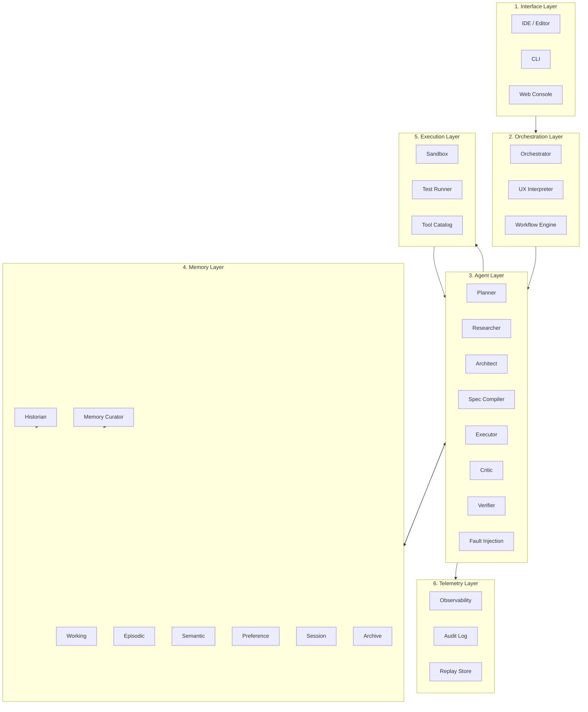
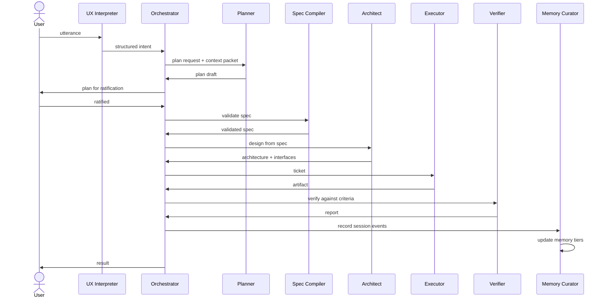
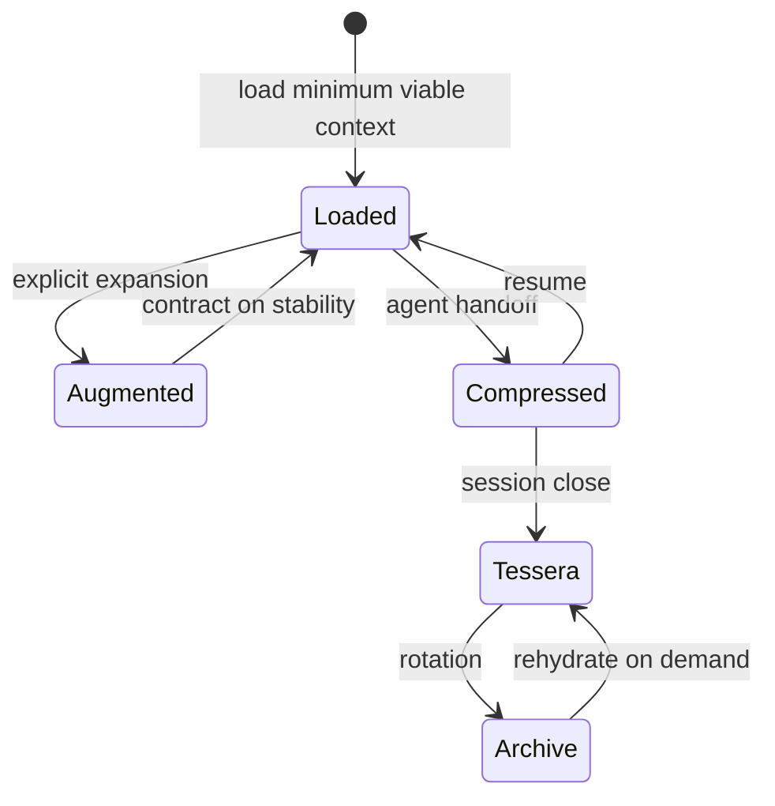
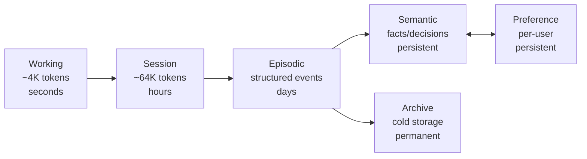
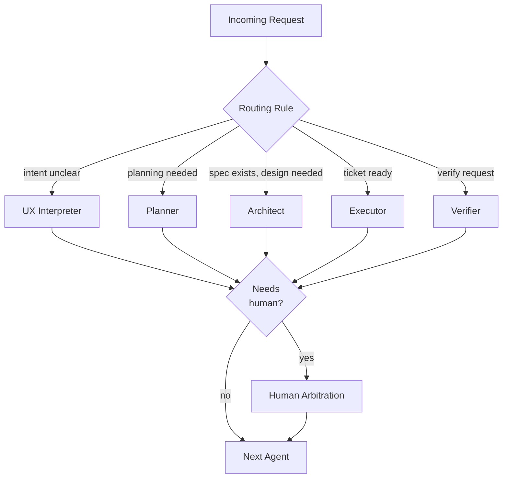

# Cognitive Architecture for AI-Augmented Engineering Teams

*A systems paper on topology, memory, and orchestration for engineering organizations that have absorbed AI into their primary workflow.*

---

## 1. Executive Summary

The dominant failure mode of AI-assisted engineering is not capability. It is **topology**.

Frontier models have increased usable context by two orders of magnitude in three years. Reliability has not followed. Teams that adopted AI agents report the same recurring incidents — drift, contradiction, fabricated APIs, lost decisions, work that contradicts work — at the same rates they reported a year ago, against models five times more capable. The problem is structural. A larger room does not make a meeting more productive.

This paper argues that AI-augmented engineering organizations require an explicit **cognitive architecture**: a layered topology of roles, memory tiers, handoff protocols, and arbitration surfaces — analogous to an operating system, but for thought rather than computation. The architecture is not a model improvement; it is the scaffolding that turns capable models into reliable systems.

The core thesis rests on four claims:

1. **Cognition is divisible.** Engineering work has been treated as a single role ("the assistant") executed by a single agent with a single context. Real cognitive work is differentiated — planning is not implementation, criticism is not creation. The same substrate (a frontier model) becomes reliable through *specialization by scaffold*, not through prompting harder.

2. **Memory is plural.** A single conversational buffer collapses working memory, episodic memory, and semantic memory into one stream that decays the same way. Reliable systems separate them, give each its own decay function, and route retrieval explicitly.

3. **Handoffs require protocol.** When a state must cross a boundary — across sessions, across agents, across humans — transcript-based continuity fails. Continuity is preserved by compressed state packets called **Tessera**, not by replaying logs.

4. **Specs precede agency.** An agent permitted to act on intent without a written commitment will drift. An agent that must first write the commitment, get it ratified, and then act against it is bounded. Specs are not documentation. They are the contract that makes verification possible.

Engineering organizations that internalize these claims build differently. They build IDEs that show context as a visible object. They build CLIs where agents declare what they will do before doing it. They build memory layers their humans can audit. They keep transcripts but treat them as logs, not authority. The remainder of this paper formalizes the architecture, defines the roles, and provides implementation guidance for IDE, CLI, and platform builders.

---

## 2. Problem Landscape

The problems below are not edge cases. They are the predictable failure modes of unstructured AI workflows operating at engineering velocity.

### 2.1 Context Collapse

Distinct concerns share a single buffer. A debugging session, a design discussion, a refactor decision, and a half-finished spec all sit in the same window, indistinguishable to the model. The model treats every prior token as equally salient context for the next response. Decisions made in one frame contaminate work in another. The user experiences this as an agent that "forgets what we just decided" — but the model has not forgotten; it has been asked to interpret the decision in a context where competing decisions are equally present.

### 2.2 Quadratic Attention Tax

Attention cost scales quadratically with context length. Effective recall — the model's actual ability to use information at position *k* — degrades long before the nominal context window fills. Empirically, recall drops sharply past a fraction of the stated limit, with the drop concentrated in the middle of the buffer. Long contexts are not free; they are taxed in fidelity. A 200K-token context window does not give you 200K tokens of usable working memory. It gives you a much smaller effective working set, with the rest serving as noise that taxes the relevant tokens.

### 2.3 Thread Entropy

Long sessions accumulate corrections, reversals, and tentative branches. By turn forty, a session contains its own contradictions — "use approach A," "actually let's use B," "going back to A but with B's error handling." The model has no canonical state; it has a history of state transitions. Asked for "the current approach," it produces a plausible synthesis that may match none of the actual decisions. Entropy in the thread directly translates to entropy in the output.

### 2.4 Hallucination Through Ambiguity

The most common cause of fabricated APIs, invented function signatures, and confidently wrong code is not model error in isolation. It is underspecified input. When the request is ambiguous, the model fills the gap with the most plausible completion from training distribution. The fabrication is statistically reasonable; it is just not real. The remedy is rarely a better model; it is a more specified input. Specs reduce hallucination by removing the slots that need filling.

### 2.5 Conversational Drift

Each turn introduces small reframings. "Let's make it faster" becomes "let's optimize the hot path" becomes "let's parallelize the inner loop" becomes "let's rewrite in a lower-level language." No single turn is unreasonable; the chain is. Drift is the integral of small reframings over a session. It is invisible at turn level and consequential at session level. Without explicit anchors, every long session drifts.

### 2.6 Tool Fragmentation

Modern agentic workflows expose dozens of tools — file readers, code searchers, test runners, package managers, browsers, databases. The agent must remember which tool returns what, in what schema, with what failure modes. Tool count grows linearly; the cognitive cost of routing between them grows worse. Many failures attributed to "the model" are actually failures to select the right tool, parse its output correctly, or recover from its failure mode. Tool fragmentation is the dominant source of agentic brittleness past a certain catalog size.

### 2.7 Memory Incoherence

Episodic memory (what happened) and semantic memory (what is true) accumulate independently and can diverge. The episodic record says "we decided to use Postgres." The semantic record says "the system uses SQLite." Both can be true at different times; the agent has no resolution layer. Without explicit reconciliation, agents query whichever store responds first and inherit its inconsistency.

### 2.8 Human Cognitive Overload

The final and most underappreciated failure mode: the human becomes the orchestration layer. When agents do not coordinate, the human coordinates them. When memory does not persist, the human persists it. When specs are not produced, the human produces them. Productivity claims about AI assistance often measure agent throughput against a human who is now doing three jobs: their original work, plus agent supervision, plus state management. The ceiling on AI-augmented engineering is not model capability. It is the human's working memory.

---

## 3. Foundational Principles

The architecture rests on ten principles. Each is stated as an invariant the system maintains.

### 3.1 Intentional Forgetting

**Invariant:** The working set is bounded. Eviction is a design choice, not an accident.

Memory systems that grow without bound become noise. Working memory has a defined budget, and material that does not earn its place is evicted to a colder tier. Forgetting is not loss; it is the precondition of clarity. The system decides what to forget the same way it decides what to load — explicitly, with criteria, with logging.

### 3.2 Lighthouse Handoffs

**Invariant:** State that must cross a boundary is compressed into a packet, not replayed as a transcript.

A Lighthouse is a small, semantically dense artifact that carries forward the *direction* of work — current goal, recent decisions, open questions, foreclosed options. It is generated by a dedicated role (the Historian), versioned, and read by the next agent or session as primary context. Lighthouses are how cognition survives session boundaries without the cost of replaying conversation.

### 3.3 Context Compression

**Invariant:** Information density is preferred to volume. Many small structured records outperform one long stream.

A 4,000-token structured spec is worth more than a 40,000-token transcript that contains the same decisions. Compression is not summarization; it is structural reformulation — turning a narrative into a graph of decisions, constraints, and interfaces.

### 3.4 Spec-First Execution

**Invariant:** Action follows a written commitment. The commitment is the unit of agreement.

An agent that proposes a spec, has it ratified, and then executes against it is fundamentally different from an agent that interprets intent and acts. The spec is the contract. Verification is well-defined against a spec and ill-defined against intent. Disagreements about output collapse into disagreements about the spec, which are tractable.

### 3.5 Role-Specialized Cognition

**Invariant:** The same model substrate is differentiated by scaffold — prompt, tools, context budget, output schema — into distinct roles.

A Planner and an Executor may be the same model. They are different agents because their scaffolds differ. Specialization happens in the surrounding system, not in the weights. This is what makes the architecture deployable today, not on a future model: specialization is a software problem.

### 3.6 Externalized Memory

**Invariant:** Agents read memory; they do not maintain it internally.

The agent treats the memory store as a database. Reads are explicit queries. Writes go through a curator. Nothing important to the next turn lives only in the current turn's context — if it matters, it has been written to a tier that survives.

### 3.7 Recursive Prompt Optimization

**Invariant:** Prompts are versioned artifacts. They improve under the same disciplines as code.

A prompt that produced a bad output is a defect; the fix is a prompt revision under version control with a test against the regression. Prompts have changelogs, owners, and review. They are not folklore.

### 3.8 Human-in-the-Loop Arbitration

**Invariant:** When agents disagree or when stakes exceed an automated threshold, a human arbitrates and the arbitration is recorded.

Humans are not the orchestration layer. They are the *appellate* layer. The system distinguishes between routine work (no human required), notable decisions (human notified), and arbitration (human required). The recorded arbitration becomes precedent for similar future decisions.

### 3.9 Progressive Context Loading

**Invariant:** Load the minimum viable context. Expand on explicit demand.

The default context for a task is the smallest packet that supports the task. Additional context is loaded by query, not by reflex. This bounds the attention tax and forces the system to model what is actually needed.

### 3.10 State Continuity Over Transcript Continuity

**Invariant:** The state object is canonical. The transcript is a log.

When the two disagree, the state object wins. The transcript records what was said; the state records what is. This separation is the single most important property of a reliable cognitive system, and the one most absent from current workflows.

---

## 4. Cognitive Role Taxonomy

The architecture defines twelve roles. Each role is a *scaffold* — a prompt template, tool budget, context budget, input schema, output schema, and escalation rule. The underlying model may be shared.

### Role Summary Table

| Role | Purpose | Primary Input | Primary Output | Context Budget | Tools |
|---|---|---|---|---|---|
| **Planner** | Decompose intent into structured plan | Intent + constraints | Plan draft | 8K | Read-only |
| **Researcher** | Gather external information | Question + scope | Citation packet | 32K | Web, docs, code search |
| **Architect** | Translate spec to system design | Ratified spec | Architecture doc + interfaces | 16K | Read-only + diagramming |
| **Spec Compiler** | Validate spec internal consistency | Spec draft | Validated spec or diff | 8K | Read-only |
| **Executor** | Implement single ticket | Ticket + interfaces | Code + tests | 8K | Write, run tests |
| **Critic** | Adversarial review | Code or document | Findings list | 16K | Read-only + lint/static |
| **Verifier** | Confirm acceptance criteria | Artifact + criteria | Pass/fail report | 4K | Run tests, run checks |
| **Fault Injection Agent** | Stress assumptions | Spec or code | Edge case list | 8K | Read-only |
| **Historian** | Compile session record | Session events | Tessera packet | 16K | Read all tiers |
| **Memory Curator** | Manage memory hierarchy | Session events + writes | Updated memory store | 8K | Write all tiers |
| **Orchestrator** | Route between agents | Agent requests | Dispatches | 4K | Workflow control |
| **UX Interpreter** | Translate human intent | Natural language | Structured intent | 4K | Clarification queries |

### 4.1 Planner

- **Purpose:** Decompose a high-level intent into a structured, sequenced plan suitable for spec compilation.
- **Input:** A user-provided intent statement plus any active project constraints from the memory store.
- **Output:** A plan draft — ordered list of objectives, dependencies, and proposed agent assignments. Schema: `{objectives: [], dependencies: [], proposed_specs: []}`.
- **Failure modes:** Over-decomposition (planning at implementation granularity); under-decomposition (objectives that hide multiple decisions); silent assumption (failing to surface foreclosed options).
- **Optimal context window:** 8K tokens. Enough for the intent, the relevant project constraints, and the prior plan if revising. More degrades focus.
- **Escalation:** If the intent cannot be decomposed without specifying a contested decision, escalate to the UX Interpreter for clarification.
- **Tool access:** Read-only access to memory store and active specs. No execution, no writes.

### 4.2 Researcher

- **Purpose:** Gather external information needed for a planning or architecture decision.
- **Input:** A scoped question with a stop condition.
- **Output:** A citation packet — claims, sources, confidence levels, conflicts noted.
- **Failure modes:** Citation laundering (treating one source's claim as multi-sourced consensus); scope creep; failure to disclose source quality.
- **Optimal context window:** 32K tokens. Research is information-dense and benefits from larger working sets than other roles.
- **Escalation:** If sources contradict and the contradiction matters, escalate to the Critic for adjudication.
- **Tool access:** Web search, document fetch, internal code search.

### 4.3 Architect

- **Purpose:** Translate a ratified spec into a system design, including module boundaries and interface contracts.
- **Input:** A spec marked as ratified by the Spec Compiler.
- **Output:** Architecture document plus interface definitions. Schema: `{modules: [], interfaces: [], data_flow: [], assumptions: []}`.
- **Failure modes:** Premature abstraction; ignoring stated non-functional constraints; specifying interfaces that cannot be implemented within the spec's bounds.
- **Optimal context window:** 16K tokens. Needs the full spec plus relevant prior architectures.
- **Escalation:** Foreclosed options must be surfaced explicitly. If an option is foreclosed and the user has not been told, escalate.
- **Tool access:** Read-only; diagramming; access to architectural memory tier.

### 4.4 Spec Compiler

- **Purpose:** Validate that a spec is internally consistent and complete enough to architect against.
- **Input:** A spec draft.
- **Output:** Validated spec, or a diff listing inconsistencies and gaps.
- **Failure modes:** Approving underspecified specs; rejecting specs for stylistic reasons unrelated to consistency.
- **Optimal context window:** 8K tokens.
- **Escalation:** If a spec is internally consistent but contradicts a higher-tier project constraint, escalate to the UX Interpreter.
- **Tool access:** Read-only.

### 4.5 Executor

- **Purpose:** Implement a single ticket against a defined interface.
- **Input:** A ticket — scope, acceptance criteria, interfaces it implements or consumes.
- **Output:** Code, tests for that code, a brief implementation note.
- **Failure modes:** Scope creep beyond ticket; ignoring acceptance criteria; modifying interfaces not owned by the ticket.
- **Optimal context window:** 8K tokens. Small contexts force tight scoping.
- **Escalation:** If implementation requires interface changes, halt and escalate to the Architect. Do not implement and document; halt.
- **Tool access:** Write within ticket scope; run tests; no architecture-tier writes.

### 4.6 Critic

- **Purpose:** Adversarial review of an artifact (code, spec, or architecture).
- **Input:** The artifact plus the spec or acceptance criteria it claims to satisfy.
- **Output:** Findings list, ranked by severity. Schema: `{findings: [{severity, claim, evidence, suggested_action}]}`.
- **Failure modes:** Stylistic noise (treating preference as defect); false confidence (asserting bugs that do not exist); reluctance (under-criticizing to avoid friction).
- **Optimal context window:** 16K tokens.
- **Escalation:** Findings of severity ≥ high require Verifier confirmation before acceptance.
- **Tool access:** Read-only, static analysis, lint, lookup of past Critic findings.

### 4.7 Verifier

- **Purpose:** Confirm that an artifact meets defined acceptance criteria, deterministically.
- **Input:** Artifact plus criteria.
- **Output:** Pass/fail report with evidence. Schema: `{criterion_id, status, evidence_ref}`.
- **Failure modes:** Soft-passing (treating partial pass as pass); confirmation bias (running only the tests the author ran).
- **Optimal context window:** 4K tokens. Verification should not require holding the whole system in mind.
- **Escalation:** Ambiguous criteria escalate to the Spec Compiler; the spec is the defect.
- **Tool access:** Test runners, check runners.

### 4.8 Fault Injection Agent

- **Purpose:** Stress-test the assumptions embedded in a spec or implementation.
- **Input:** A spec or implementation plus its stated assumptions.
- **Output:** A list of edge cases and scenarios that would break the system. Schema: `{scenario, assumption_violated, severity}`.
- **Failure modes:** Adversarial nihilism (generating infinite low-probability cases); missing the high-probability case (real-world failure modes).
- **Optimal context window:** 8K tokens.
- **Escalation:** High-severity findings escalate to the Architect for spec revision.
- **Tool access:** Read-only.

### 4.9 Historian

- **Purpose:** Compile a Tessera packet — a compressed handoff artifact — at session close or on demand.
- **Input:** Session events (transcript, spec changes, decisions, arbitrations).
- **Output:** A Tessera packet (see §6.6).
- **Failure modes:** Including too much (defeats compression); including too little (loses recoverable state); editorializing.
- **Optimal context window:** 16K tokens.
- **Escalation:** None routine. Historian output is reviewed by the user on hand-off.
- **Tool access:** Read access to all memory tiers; write access only to the Tessera tier.

### 4.10 Memory Curator

- **Purpose:** Maintain the integrity of the memory hierarchy — write new entries, manage decay, resolve conflicts between tiers.
- **Input:** Session events; write requests from agents.
- **Output:** Updated memory store.
- **Failure modes:** Promoting noise to long-term memory; failing to evict superseded entries; allowing tier divergence.
- **Optimal context window:** 8K tokens.
- **Escalation:** Conflicts between episodic and semantic memory escalate to the user via the Orchestrator.
- **Tool access:** Write across all memory tiers; access to a memory diff tool.

### 4.11 Orchestrator

- **Purpose:** Route work between agents according to the workflow definition.
- **Input:** Agent output, escalations, user inputs.
- **Output:** Dispatches to next agent.
- **Failure modes:** Routing loops; starving low-priority agents; failing to surface escalations to the user.
- **Optimal context window:** 4K tokens. Orchestration is shallow.
- **Escalation:** Anything explicitly marked for the user routes to the user immediately.
- **Tool access:** Workflow control only. No reads or writes to memory.

### 4.12 UX Interpreter

- **Purpose:** Translate ambiguous natural-language requests into structured intent.
- **Input:** A user utterance.
- **Output:** Structured intent or a single clarifying question.
- **Failure modes:** Asking too many clarifying questions (turning the user into a form); guessing without disclosure (silent assumption).
- **Optimal context window:** 4K tokens.
- **Escalation:** If three rounds of clarification do not yield structured intent, escalate to the user with a draft interpretation and a binary confirmation.
- **Tool access:** Read access to user preferences and recent session history.

---

## 5. System Architecture

The system is organized into six layers. Information flows top-down for intent and bottom-up for state.

### 5.1 Multi-Layer Architecture



### 5.2 Data Flow



### 5.3 Context Lifecycle



### 5.4 Memory Hierarchy



### 5.5 Agent Orchestration



### 5.6 Human Override Model

The human override surface is explicit and tiered. Three categories:

1. **Notification** — recorded but not blocking. Agent proceeds.
2. **Confirmation** — blocking. Agent proceeds only on positive confirmation. Default for any cross-boundary state change.
3. **Arbitration** — blocking with required reasoning. Used when two agents produce contradictory outputs. Reasoning is recorded as precedent.

The override surface is the single interaction the human cannot delegate. It is the system's bottleneck and its safety floor.

---

## 6. Memory Architecture

### 6.1 Working Memory

- **Scope:** Current turn or current agent invocation.
- **Capacity:** Bounded by the agent's context budget (4K–32K tokens depending on role).
- **Decay:** Total. Working memory does not persist beyond the agent's invocation; anything that must persist is written to a colder tier by the Memory Curator.
- **Retrieval:** Fully present in context; no retrieval needed.
- **Compression:** None; bounded by definition.

### 6.2 Session Memory

- **Scope:** Current user session (a working period; minutes to hours).
- **Capacity:** ~64K tokens of structured events, plus a transcript log.
- **Decay:** Soft. Older session events are summarized into a session digest at configurable intervals (e.g., every 10K tokens of transcript).
- **Retrieval:** By recency and relevance score; queried by agents on demand.
- **Compression:** Rolling summarization. The session ends with a Tessera handoff packet (§6.6).

### 6.3 Episodic Memory

- **Scope:** Project-scoped record of structured events — decisions made, specs ratified, arbitrations recorded, artifacts produced.
- **Capacity:** Unbounded but sparse. Stored as a graph of events.
- **Decay:** None for raw events; the Memory Curator may mark events as superseded.
- **Retrieval:** Event-graph query. Agents query by decision type, by entity, by time range.
- **Compression:** Periodic compaction; superseded events are summarized into the surviving decision.

### 6.4 Semantic Memory

- **Scope:** Project-scoped facts and stable decisions — what the system is, what the system does, what the system will never do.
- **Capacity:** Bounded. Forced bounded — if semantic memory grows past its budget, the Memory Curator must promote some entries to archive or escalate to the user.
- **Decay:** None within budget; eviction by curator.
- **Retrieval:** Direct query; semantic similarity over embeddings.
- **Compression:** Restatement on conflict — when episodic memory shows that a semantic entry is stale, the curator updates it and records the supersession.

### 6.5 Preference Memory

- **Scope:** Per-user, cross-project. Stable preferences — communication style, output format, escalation thresholds.
- **Capacity:** Small. Preference memory is a curated profile, not a log.
- **Decay:** None. Preferences change only by explicit user statement.
- **Retrieval:** Loaded at session start; available to all agents.
- **Compression:** Not applicable; bounded by design.

### 6.6 Tessera Checkpoints

A Tessera is the canonical handoff packet — a small, dense, structured record produced by the Historian. The name (from Latin *tessera*, the small tiles that compose a mosaic) reflects the function: a Tessera is a single tile of state that, combined with others, reconstitutes the full picture.

**Schema:**

```yaml
tessera:
  id: uuid
  session_id: uuid
  generated_at: timestamp
  generated_by: historian-version
  project: string
  active_spec: ref
  current_goal: string                  # one sentence
  recent_decisions:                     # last 3-7
    - decision: string
      rationale: string
      reversibility: low | medium | high
  open_questions:                       # outstanding ambiguities
    - question: string
      blocking: boolean
  foreclosed_options:                   # paths explicitly closed
    - option: string
      reason: string
  artifacts_produced: [refs]
  next_action: string                   # one sentence
  warnings: [string]                    # known fragilities
```

A Tessera is what a new session reads on resume. It replaces transcript replay.

### 6.7 Context Handoff Packets

When an agent hands off to another agent mid-session, the packet is smaller than a Tessera but follows the same compression discipline:

```yaml
handoff:
  from_agent: role
  to_agent: role
  reason: string
  spec_ref: uuid
  acceptance_criteria: [string]
  context_refs: [memory tier refs]
  constraints: [string]
  prior_findings: [optional]
```

### 6.8 Decay and Retrieval Heuristics

Each tier has an explicit decay and retrieval function. The defaults below are tunable per deployment.

| Tier | Decay Function | Retrieval Heuristic |
|---|---|---|
| Working | Total at invocation end | Present in context |
| Session | Rolling summary every N tokens | Recency × salience |
| Episodic | None; supersession-based | Event graph query |
| Semantic | Bounded; curator eviction | Embedding similarity + tag |
| Preference | None | Loaded eagerly |
| Archive | None | On-demand rehydration |

### 6.9 Relevance Scoring

Retrieval from session and episodic memory uses a composite score:

```
relevance(entry, query) =
    w_sim · semantic_similarity(entry, query)
  + w_rec · recency_decay(entry.timestamp)
  + w_sal · salience(entry)
  + w_pin · pinned(entry)
```

Where `pinned(entry)` is a boolean elevation set by the user. The Lighthouse pinning question — what gets pinned and by whom — remains an open design question in adjacent systems (see Context Synapse). The default position here is: the user pins by explicit gesture; agents may *request* a pin via the Orchestrator.

---

## 7. IDE / CLI Design Principles

Tool builders implementing this architecture should treat the following as first-class design constraints, not features.

### 7.1 Latency Perception

Perceived responsiveness matters more than measured latency past a few hundred milliseconds. Stream tokens as they arrive. Show progress for long operations. A 30-second operation that displays its plan and then streams output feels faster than a 10-second operation that returns silently.

### 7.2 Invisible Orchestration

Orchestration is plumbing. The user should be able to ignore which agent is currently running. Reveal the topology only when the user asks for it or when something has gone wrong. A user who wants to understand the routing can open the cognitive topology view (§ Deliverable 2); a user who wants to ship code should not have to.

### 7.3 Context Transparency

The user must be able to see what context the current agent is operating on. A panel showing loaded context — which memory entries, which prior session digest, which active spec — turns the system from a black box into an inspectable one. Trust calibration depends on this.

### 7.4 Interruptibility

Every agent operation is interruptible at well-defined boundaries (per turn, per tool call, per sub-task). The interrupt is not destructive — interrupted work is checkpointed as a Tessera, not lost.

### 7.5 Cognitive Load Minimization

Surface area should be inversely proportional to expected cognitive cost. Common operations are immediate; rare operations are discoverable. The system avoids both extremes — the IDE-with-fifty-panels and the chat-window-with-no-affordances.

### 7.6 Multi-Agent Visibility

When more than one agent is active, the user can see which. Active agents are surfaced as named, distinguishable entities (not "Assistant 1, Assistant 2"). The display is calm — no anthropomorphic noise — and informative.

### 7.7 State Visualization

The current state of the project (active spec, open tickets, pending arbitrations) is visible without action. The cognitive topology map (§ Deliverable 2) is the dedicated surface for this.

### 7.8 Deterministic Execution Paths

A given input, against a given memory state, against a given prompt version, should yield the same routing. Non-determinism in routing is a bug. Non-determinism in model output is a property; the system manages it by re-running and comparing where it matters.

### 7.9 Spec-Driven Task Execution

The system makes specs the path of least resistance. The button to "do this thing" produces a spec draft, not direct execution. The user learns the spec discipline by using the tool.

### 7.10 Progressive Disclosure

The default view is minimal. Power features (prompt diffing, replay, memory editing) are one click deeper. The system reveals complexity at the user's pace.

### 7.11 Failure Recoverability

Every failure surfaces a clear path forward — retry, alter context, escalate to human, abandon. The system does not strand the user in a state they cannot exit.

### 7.12 Human Trust Calibration

The system reports its own confidence. Agents that produce output mark uncertainty. The Verifier produces evidence, not assertions. Over time, the user calibrates trust against accurate confidence reports; this is impossible against systems that report uniform confidence.

---

## 8. Interaction Patterns

### 8.1 Spec.md Workflows

The unit of agreement in the system is a versioned `spec.md` file. The pattern:

1. User states intent.
2. UX Interpreter clarifies if needed; Planner produces a spec draft.
3. User reviews and ratifies (possibly with edits).
4. Spec Compiler validates internal consistency.
5. Architect produces an architecture against the ratified spec.
6. Executor implements tickets against the architecture.
7. Verifier checks against acceptance criteria from the spec.
8. Historian records the closure in a Tessera.

The spec is the artifact every later step refers to. Changing the spec mid-execution is allowed but requires explicit re-ratification.

### 8.2 Branch-Per-Agent Execution

Agents that produce code work on isolated branches. Multiple Executors can work in parallel on independent tickets. The Orchestrator merges or escalates conflicts. This pattern maps directly onto existing Git workflows and is the lowest-friction way to operationalize multi-agent execution.

### 8.3 Prompt Compilation Pipelines

Prompts are not strings; they are compiled artifacts.

```
prompt_source.md →
  variable_resolution →
  context_injection →
  scaffold_application →
  rendered_prompt
```

The compiled prompt is logged with the response. A regression in output is debugged by diffing prompts, not by debugging the model.

### 8.4 Agent Arbitration Systems

When two agents produce contradictory outputs (e.g., Critic flags a defect that Verifier passes), the Orchestrator runs an arbitration:

1. Re-run both agents with explicit awareness of the other's output.
2. If still contradictory, route to a third agent of a different role (typically the Architect or the user).
3. Record the arbitration outcome as precedent.

### 8.5 AI Pair-Programming Loops

The pair-programming pattern, when AI-augmented, has three sub-patterns:

- **Driver / Navigator:** human drives, agent navigates (Critic-style).
- **Inverse driver:** agent drives (Executor), human navigates (Critic).
- **Dual driver:** two agents drive on the same problem, human selects.

The IDE supports all three explicitly; the user picks the mode for the task.

### 8.6 Verification Chains

A verification chain is a sequence: Spec Compiler → Critic → Verifier → Fault Injection Agent. Each adds a different kind of check. The chain is not invoked for every artifact — only for ones marked for high assurance, typically merges to main or releases.

### 8.7 Context Relay Mechanisms

When work crosses a boundary — agent to agent, session to session, machine to machine — the relay is by Tessera. The Tessera is the wire format. Agents read Tessera; humans read Tessera; tools read Tessera. The transcript is never the relay.

---

## 9. Anti-Patterns

The patterns below are common in current AI workflows and degrade system quality at scale. Each is paired with a diagnosis and a remediation.

### 9.1 Infinite Conversational Accretion

- **Pattern:** Sessions that run for thousands of turns, accumulating drift and contradiction.
- **Diagnosis:** No session boundaries; no Tessera handoffs; no decay function.
- **Remediation:** Force a Tessera at configurable intervals (e.g., every N turns or every M minutes). The Tessera becomes the start of the next "session."

### 9.2 Over-Contextualization

- **Pattern:** Stuffing every available context into every prompt, on the theory that more context is better.
- **Diagnosis:** Misunderstanding of the attention tax; treating context as free.
- **Remediation:** Progressive context loading; explicit retrieval; small default working sets.

### 9.3 Monolithic Agents

- **Pattern:** One agent does everything — plans, executes, criticizes its own output.
- **Diagnosis:** Role conflation; the agent is incentivized to confirm rather than criticize its own work.
- **Remediation:** Role specialization. Critics and Verifiers must be different scaffolds from Executors.

### 9.4 Stateless Execution

- **Pattern:** Each request is treated as standalone; no memory of prior decisions.
- **Diagnosis:** Missing memory layer; agents have no externalized state.
- **Remediation:** Memory hierarchy with explicit retrieval; preference memory loaded eagerly.

### 9.5 Blind Autonomous Execution

- **Pattern:** Agents authorized to make consequential changes without explicit human confirmation.
- **Diagnosis:** Missing arbitration tier; trust calibration assumed rather than earned.
- **Remediation:** Confirmation gates by default for cross-boundary changes; Notification tier for routine ones; explicit Arbitration for contested ones.

### 9.6 Tool Thrashing

- **Pattern:** Agent rapidly cycles through tools, often calling the same tool repeatedly with minor variations.
- **Diagnosis:** Tool catalog too large or too undifferentiated; agent has no schema for tool selection.
- **Remediation:** Tool catalog curation per role; tool budgets per agent invocation; tool usage telemetry surfaced in observability.

### 9.7 Prompt Cargo Culting

- **Pattern:** Copying prompts that worked elsewhere without understanding why, or accreting "magic words" without testing.
- **Diagnosis:** Prompts treated as folklore rather than artifacts.
- **Remediation:** Versioned prompts under code review; regression tests against representative inputs; changelog discipline.

---

## 10. Future Directions

The architecture above is buildable today against current models. The following directions are forward-looking and have a research component.

### 10.1 Persistent Cognitive Substrates

Memory today is bolted onto stateless models via retrieval. A persistent cognitive substrate — model state that survives between invocations and can be selectively reloaded — would change the cost structure of long-running work. This is not the same as fine-tuning; it is closer to the model equivalent of a process being suspended and resumed.

### 10.2 Self-Organizing Agent Ecosystems

The role taxonomy here is human-authored. A self-organizing system would propose new roles when existing ones consistently fail to cover a workload, retire roles that go unused, and reshape its own topology. The risk is loss of inspectability; the constraint is that any topology change must be human-ratified and recorded.

### 10.3 Memory-Native Operating Systems

The memory hierarchy in this paper is application-layer. A memory-native operating system would expose tiered memory primitives at the OS level — comparable to virtual memory but for semantic content. Applications would inherit a coherent memory model rather than reinventing it. The Mac, with its strong precedent for system-level services, is a plausible host.

### 10.4 Cognitive IDEs

Today's IDEs are file-centric. A cognitive IDE is spec-centric and topology-aware — the primary view is the cognitive topology map, files are derived artifacts, and the agent layer is first-class. The IDE in Deliverable 2 is a step toward this; the full version requires conventions and standards that do not yet exist.

### 10.5 Ambient Orchestration Layers

Orchestration today is invoked explicitly. An ambient layer continuously monitors session state and offers transitions — "this is a good moment for a Tessera," "the Critic has not run on this branch," "two agents are about to produce conflicting interfaces." Ambient orchestration is the difference between a tool you operate and a tool that collaborates.

### 10.6 Personalized Reasoning Priors

Preference memory today is shallow — formatting, tone. A deeper version is reasoning priors — the user's typical decomposition style, their bias toward certain patterns, their idiosyncratic vocabulary. The system would learn these and offer them to agents as context. The ethical surface here is significant; the boundary on operational context inference (see related work in local-first cognitive systems) applies fully.

### 10.7 AI-Native Operating Environments

The endpoint of this trajectory is an operating environment built around AI augmentation rather than retrofitted with it. The filesystem is semantic. The shell is conversational where useful and structured where necessary. The notification model accounts for agent-generated events. The trust model is calibrated, layered, and inspectable. We are not there yet. The architecture in this paper is a stepping stone, not a destination.

---

## Closing

The argument of this paper compresses to a single claim: **reliability in AI-augmented engineering is a topology problem, not a capability problem.** The roles, memory tiers, handoff protocols, and arbitration surfaces described here are the topology. They are not exotic. They are largely the same disciplines that operating systems, databases, and distributed systems already embody — applied to a substrate whose unit of computation happens to be a language model.

The systems that will compound their advantage over the next several years will not be those with the biggest context windows or the most agents. They will be those that have done the unglamorous work of building cognitive topology — explicit roles, plural memory, compressed handoffs, ratified specs, human-arbitrated trust. The model will keep improving. The topology, once built, will keep being worth what it cost.

---
